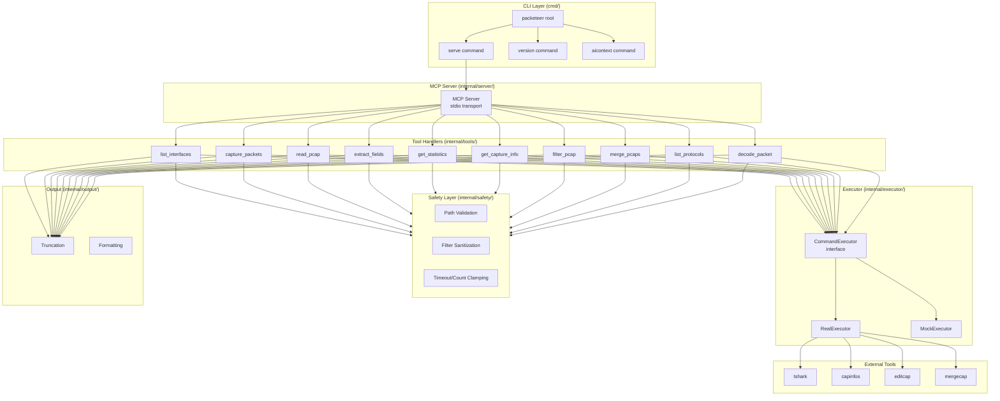
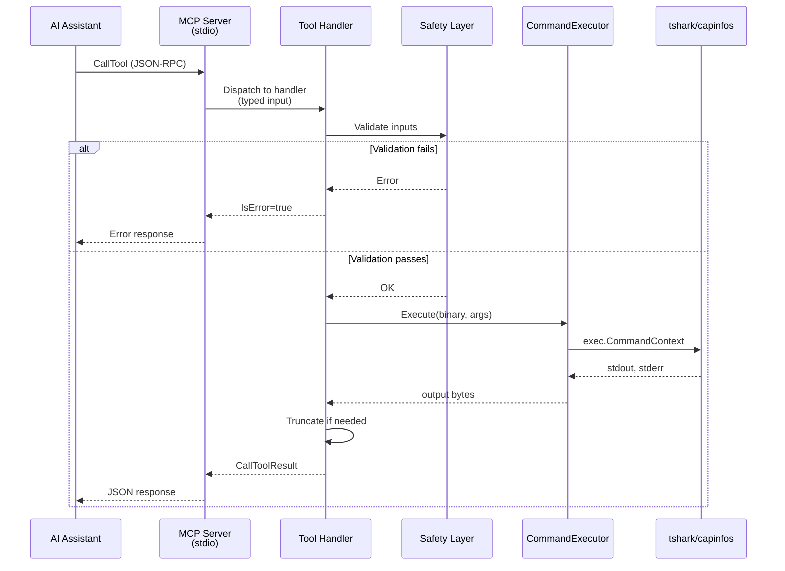
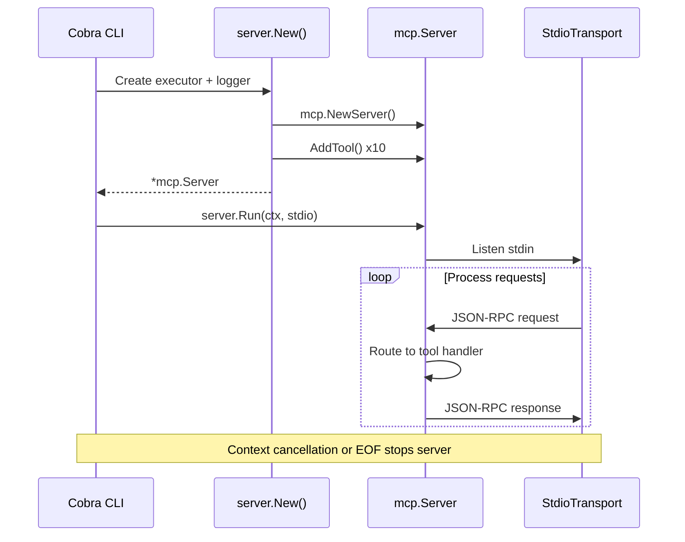

# Architecture

## System Overview

## MCP Request Flow

## Server Lifecycle

## Key Design Decisions

- **Hexagonal Architecture:** `CommandExecutor` interface decouples tool handlers from real CLI execution, enabling full unit testing with `MockExecutor`
- **Safety First:** All inputs validated before any command execution — path traversal blocked, filters sanitized, timeouts clamped
- **Stdio Transport:** MCP JSON-RPC over stdin/stdout; all logging to stderr to avoid protocol corruption
- **Output Truncation:** Large captures truncated to 512KB with metadata about omitted data
